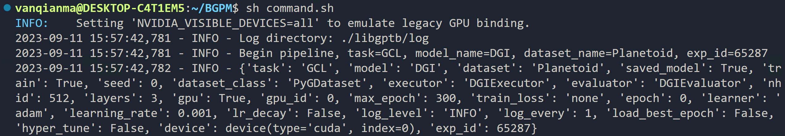
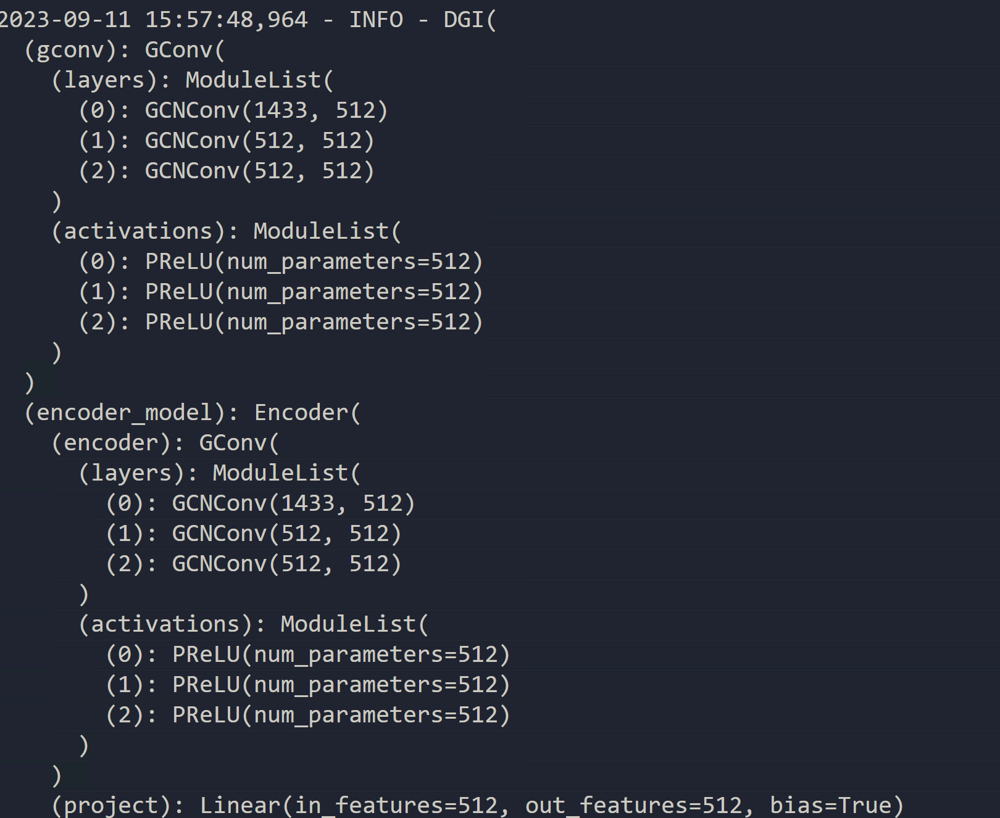
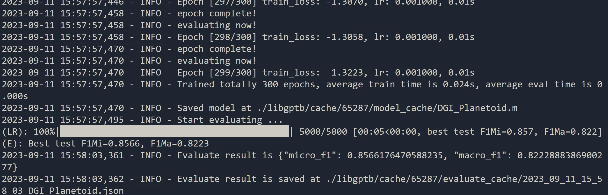

# Pipeline for "Benchmarking Graph Pretraining Methods" (BGPM)

## Instructions

### Why we build this pipeline?

1. There is a lot of parameters to set. It's not practical to set all of them manually in your main function.
2. There is a lot of results to record. It's necessary to record the results with corresponding settings.

### How can this pipeline help us?

1. The **ConfigParser** will read the config file of your settings(e.g., learning rate,hidden_size) or default settings and set them for datasets or the corresponding executor of the model chosed by you.

2. The **./libgptb/log folder** will restore the config settings and the **./libgptb/cache folder** will restore the evaluate results with the exam_id. Then you can easily collect them.

3. The execution is something like the screeshots.

   

   

   


### How is this pipeline organised?

You can find the whole process in `libgptb/pipeline/pipeline.py`

In brief the whole process will be like

1. **ConfigParser** will load the config file and default config file for the **Dataset** and **Executor**
2. **Dataset** will load the data and get some features(e.g., input feature dims)
3. **Executor** will load the chosen model and the model will be trained and evaluated with stored evaluation results.

### How to use this pipeline to execute my model?

You will need to create you own **Dataset** and **Executor**.You can refer to my reference for DGI.
We will talk more about this in the following sections.

### Anything else I need to know about this pipeline?

**The execution environment**

I am inspired with the [PyGCL repo](https://github.com/PyGCL/PyGCL) and my [CIKM23-HIEST repo](https://github.com/VAN-QIAN/CIKM23-HIEST).

[PyGCL Examples]([PyGCL/examples at main · PyGCL/PyGCL (github.com)](https://github.com/PyGCL/PyGCL/tree/main/examples)) may not contains all our target models, so the singularity image I prepared for it may not suitable for those excluded models.

In this case yo may need to build a new one.If you are using singularity for HPC then you can find a [guide]([VAN-QIAN/CIKM23-HIEST: CIKM23-HIEST (github.com)](https://github.com/VAN-QIAN/CIKM23-HIEST#5-running-environment)) in my repo or ask for help.

## Quick Start to execute your model.

Taking my implementation for DGI as an example. Let's see what you need to implement to execute your model.

### 1.  Add default config

You may need to add default configs for your **Executor** and **Model**. Check `libgptb/config/executors/DGIExecutor.json` and `libgptb/config/model/GCL/DGI.json` (Here GCL is the task name) and create yours.

So far for the implementation for **dataset** we use the pytorch_geometric.datasets. If there is a need for default config maybe we will need to use our implemtation in the futhure.

The config parameters specified by the user have the highest priority. In other words the default config will be overwrittern.

### 2. Add your Dataset implementation

You may need to implemetn two methods `get_data` and `get_data_feature` . Then put it under the folder `libgptb/data/dataset/`

Then you will need to complete the import in `libgptb/data/dataset/__init__.py`

You can refer to my implementation `libgptb/data/dataset/pyg_dataset.py`

### 3. Add your Model implementation

You may need to define your model structure and put it under the folder `libgptb/model`.

Then you will need to complete the import in `libgptb/model/__init__.py`

You can refer to my implementation in `libgptb/model/DGI.py`

### 4. Add you executor implementation

You may need to define how to train and evaluate your model and put it under the folder `libgptb/executors/`.

Then you will need to complete the import in `libgptb/executors/__init__.py`

You can refer to my implementation in `libgptb/executors/DGI_executor.py`

### 5. Add your task configuration

You may beed to add your task configuration in `libgptb/config/task_config.json`

You can refer to my implementation in `libgptb/config/task_config.json` for DGI
```json
"$YourModelName": {
            "dataset_class": "$YourDatasetName",
            "executor": "$YourExecutorName",
            "evaluator": "$YourEvaluatorName"
        }
```

These variables are what you imported in the above steps.
Now everything should be ready for execution.

## The execution environment

### 1. Requirements.txt

```
torch_geometric 
tqdm
numpy
scikit-learn
networkx
PyGCL
```

### 2. Singularity.def file

```bash
#Bootstrap is used to specify the agent,where the base image from,here localimage means to build from a local image
Bootstrap: localimage
## This is something like 'From' in DOCKERFILE to indicate the base image
From: ./pytorch_1.13.1-cuda11.6-cudnn8-devel.sif

# %files can be used to copy files from host into the image
# like 'COPY' in DOCKERFILE
# Here we copy the requirements.txt into the image, then we can use it to install the required dependencies.
%files
    ../PyGCL/requirements.txt /opt

# %post is used to build the new image
# Usage is same to shell.Here we used pip to install dependencies.
%post
    pip install -r /opt/requirements.txt
    pip install tensorboard
    pip install pyg_lib torch_scatter torch_sparse torch_cluster torch_spline_conv -f https://data.pyg.org/whl/torch-1.13.0+cu116.html
    pip install  dgl -f https://data.dgl.ai/wheels/cu116/repo.html 
    pip install  dglgo -f https://data.dgl.ai/wheels-test/repo.html 

 
#% environment is used to set env_variables once the image starts
# These lines are necessary to load cuda
%environment
    export PATH=$PATH:/usr/local/cuda-11.6/bin
    export LD_LIBRARY_PATH=$LD_LIBRARY_PATH:/usr/local/cuda-11.6/lib64:/usr/lib/x86_64-linux-gnu

# singularity exec --writable-tmpfs --nv --nvccli ../../SIF/HIEST.sif python3 ./DGI_inductive.py
```

